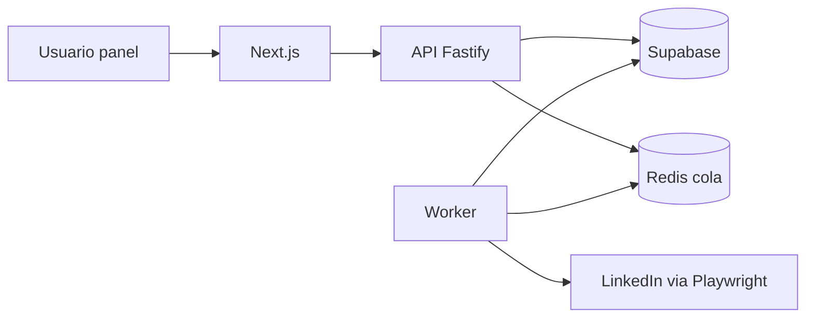

# Guía paso a paso: uso y gestión

Automatizar LinkedIn puede **vulnerar los términos de servicio** de LinkedIn y conllevar bloqueos. Usa el sistema bajo tu propia responsabilidad.

---

## 1. Qué componentes tienes

| Pieza | Función |
|--------|---------|
| **Supabase** | Usuarios (Auth), base de datos Postgres, Storage de imágenes |
| **Redis** | Cola de tareas (`automation_tasks:due`), semáforo de navegadores (máx. 4), límites diarios |
| **API Fastify** (`backend`) | REST autenticada con JWT de Supabase; cifra `li_at` y encola trabajos |
| **Worker** | Saca tareas, abre Chromium (Playwright), ejecuta y cierra el navegador |
| **Scheduler** | Crea tareas de “calentamiento” y de sondeo de mensajes/comentarios sin duplicar en exceso |
| **Frontend Next.js** | Panel web (login, proxies, cuentas, leads, campañas, posts, reglas, tareas) |

---

## 2. Proxies, VPS y Redis (paso a paso)

### 2.1 VPS (Hetzner u otro, Ubuntu 22)

1. **Crear el servidor** en el panel del proveedor (p. ej. Hetzner CX22: 2 vCPU, 4 GB RAM, Ubuntu 22.04).
2. **SSH:** `ssh root@IP_DEL_SERVIDOR` (o usuario que te dé el proveedor).
3. **Actualizar sistema:**
   ```bash
   apt update && apt upgrade -y
   ```
4. **Usuario opcional (recomendado):** crear usuario con `sudo` y desactivar login directo root por SSH cuando domines el acceso.
5. **Firewall básico (UFW):** permitir solo lo necesario:
   ```bash
   apt install -y ufw
   ufw allow OpenSSH
   ufw allow 80/tcp
   ufw allow 443/tcp
   ufw enable
   ```
   La API no debe quedar expuesta en un puerto público sin **Nginx + HTTPS** (ver [`DEPLOY.md`](DEPLOY.md)); internamente Node escucha en `127.0.0.1:3001`.
6. **Node.js LTS** (ej. 22):
   ```bash
   curl -fsSL https://deb.nodesource.com/setup_22.x | bash -
   apt install -y nodejs
   ```
7. **Clonar/copiar el proyecto**, `npm install`, `npx playwright install chromium` dentro de `automation`, builds de `automation` y `backend`.
8. **PM2:** `npm i -g pm2` y arrancar con [`ecosystem.config.cjs`](ecosystem.config.cjs).

### 2.2 Redis en el VPS (local, sin contenedor obligatorio)

1. **Instalar:**
   ```bash
   apt install -y redis-server
   ```
2. **Que escuche solo en localhost** (más seguro). Edita `/etc/redis/redis.conf` y asegúrate de:
   - `bind 127.0.0.1 ::1` (o solo `127.0.0.1`)
   - `protected-mode yes`
3. **Reiniciar:**
   ```bash
   systemctl enable redis-server
   systemctl restart redis-server
   systemctl status redis-server
   ```
4. **Probar:**
   ```bash
   redis-cli ping
   ```
   Debe responder `PONG`.
5. **En `backend/.env`:**
   ```env
   REDIS_URL=redis://127.0.0.1:6379
   ```
   No abras el puerto 6379 en el firewall hacia Internet: Redis es solo para procesos en el mismo VPS (API + workers + scheduler).

**Qué guarda Redis en esta app**

| Clave / patrón | Uso |
|----------------|-----|
| `automation_tasks:due` | Cola ordenada por tiempo (ZSET) de ids de tarea |
| `browser:active_count` | Semáforo: máximo 4 navegadores Chromium a la vez |
| Claves `limit:visit:…`, `limit:connect:…`, `limit:message:…` (por cuenta y día UTC) | Contadores diarios |
| `sched:poll_messages:{accountId}` / `sched:poll_comments:...` | Evita spamear tareas de sondeo |

### 2.3 Proxies residenciales (Webshare u otro)

**Idea:** 1 cuenta LinkedIn ↔ 1 proxy fijo. El tráfico de Playwright sale por esa IP, coherente con “parecer” un usuario en una ubicación estable.

1. **Contratar** el plan de proxies estáticos/residenciales en Webshare (u otro proveedor que te dé **host, puerto, usuario, contraseña**).
2. En el panel del proveedor, **crea o copia** un endpoint de proxy (formato suele ser `host:port` + auth).
3. En el **dashboard de la app** → **Proxies** → **Añadir:**
   - **Host:** p. ej. `p.webshare.io` o el que indique Webshare
   - **Puerto:** número (a veces distinto por IP)
   - **Usuario / contraseña:** si el proveedor usa autenticación (típico en Webshare)
4. El backend guarda la contraseña del proxy **cifrada** con la misma `COOKIE_ENCRYPTION_KEY` que usas para cookies (si quieres separar secretos en el futuro, se puede cambiar en código).
5. Al **crear una cuenta LinkedIn** sin indicar `proxy_id`, la API asigna automáticamente un proxy **activo** poco usado (`last_used` más antiguo). Si no hay ninguno, devuelve error: primero debes dar de alta proxies.
6. **Si un proxy falla** (timeout, error de red), el worker puede marcarlo `degraded` en BD; añade más proxies en el pool y reasigna manualmente en Supabase (`linkedin_accounts.proxy_id`) si hace falta.

**Formato que usa Playwright** (interno): `http://HOST:PORT` con `username`/`password` en opciones de contexto; no hace falta que lo escribas a mano en el panel más allá de host/puerto/credenciales.

### 2.4 Orden recomendado el día del despliegue

1. VPS listo + firewall.  
2. Instalar **Redis** y comprobar `redis-cli ping`.  
3. Variables `backend/.env` (Supabase, `COOKIE_ENCRYPTION_KEY`, `REDIS_URL`, Gemini opcional).  
4. Build + **PM2** (api, worker, scheduler).  
5. Nginx + certificado (Let’s Encrypt) hacia la API.  
6. Dar de alta **proxies** en el panel (o vía API).  
7. **LinkedIn** `li_at` y resto del flujo.

---

## 3. Puesta en marcha (primera vez)

### 3.1 Supabase

1. Crea un proyecto en [supabase.com](https://supabase.com).
2. En **SQL Editor**, pega y ejecuta el archivo [`supabase/migrations/001_initial_schema.sql`](supabase/migrations/001_initial_schema.sql).
3. En **Authentication → Providers**, activa **Email** (contraseña o magic link, según prefieras).
4. Anota:
   - URL del proyecto  
   - **anon key** (pública, para el frontend)  
   - **service_role key** (solo servidor, nunca en el navegador)

### 3.2 Redis (recordatorio rápido)

- **VPS:** ya detallado en la sección **2.2** (instalación y `REDIS_URL`).
- **Windows (desarrollo):** Redis vía WSL, Docker o instalador; misma URL `redis://127.0.0.1:6379` en `backend/.env`.

### 3.3 Variables de entorno

Copia [`.env.example`](.env.example).

**Backend** (archivo `backend/.env` o variables del sistema / PM2):

- `SUPABASE_URL`, `SUPABASE_SERVICE_ROLE_KEY`
- `COOKIE_ENCRYPTION_KEY` — cadena larga y secreta (32+ caracteres recomendado); **si la cambias, las cookies ya guardadas no se podrán descifrar**.
- `REDIS_URL` — por defecto `redis://127.0.0.1:6379`
- `GEMINI_API_KEY` — opcional pero necesario para IA (mensajes/posts/imagen)
- `GEMINI_MODEL` — modelo de texto (p. ej. el que tengas disponible en Google AI)
- `PLAYWRIGHT_HEADLESS=true` en servidor; `false` solo para depuración local

**Frontend** (`frontend/.env.local`):

- `NEXT_PUBLIC_SUPABASE_URL`
- `NEXT_PUBLIC_SUPABASE_ANON_KEY`
- `NEXT_PUBLIC_API_URL` — URL de tu API (local: `http://127.0.0.1:3001`)

### 3.4 Instalación y builds

En la raíz del monorepo:

```bash
npm install
cd automation
npx playwright install chromium
cd ..
npm run build -w automation
npm run build -w backend
npm run build -w frontend
```

---

## 4. Desarrollo local (cuatro procesos)

Abre **cuatro terminales** desde la raíz del repo:

1. **Redis** (si no está como servicio): asegúrate de que el puerto 6379 esté activo.

2. **API** — carga `backend/.env` (puedes usar `dotenv` ya incluido si ejecutas desde `backend` con variables exportadas):

   ```bash
   cd backend
   npm run dev
   ```

   Por defecto escucha en el puerto **3001**.

3. **Worker:**

   ```bash
   cd backend
   npm run worker
   ```

4. **Scheduler** (opcional en local si quieres warmups/polls automáticos):

   ```bash
   cd backend
   npm run scheduler
   ```

5. **Frontend:**

   ```bash
   cd frontend
   npm run dev
   ```

Entra en `http://localhost:3000`, regístrate o inicia sesión.

---

## 5. Uso del panel (flujo típico de un usuario)

### 5.1 Proxies (Webshare u otro)

1. Ve a **Proxies**.
2. Añade **host**, **puerto** y, si aplica, usuario/contraseña del proxy residencial.
3. Sin al menos un proxy **activo**, al crear una cuenta LinkedIn la API puede rechazar la petición (“No proxy available”).

### 5.2 Conectar LinkedIn (`li_at`)

1. Inicia sesión en LinkedIn en el navegador.
2. DevTools → **Application** → **Cookies** → `linkedin.com` → copia el valor de **`li_at`**.
3. En **LinkedIn**, pega el valor y guarda.
4. Se crea una tarea `verify_session`: el worker abre LinkedIn, inyecta la cookie y marca la cuenta como `active` o `error`.

### 5.3 Leads

- **Una URL:** formulario rápido.
- **Varias:** pestaña de importación, una URL por línea (deben empezar por `http`).

### 5.4 Campañas

1. **Campañas** → crea una campaña (nombre).
2. Selecciónala → define **pasos** en orden: tipo (`visit_profile`, `connect`, `send_message`, etc.), **delay_hours** (espera antes de ese paso respecto al anterior completado) y plantilla con `{name}` si aplica.
3. **Guardar pasos**.
4. **Iniciar** — se crean inscripciones (`campaign_enrollments`) para todos tus leads (o puedes ampliar la API para filtrar `lead_ids`) y se encolan tareas.

**Pausar** detiene la campaña y pausa inscripciones existentes.

### 5.5 Posts con IA

1. **Posts** → tema → opcional “Generar imagen”.
2. Se guarda un borrador en Supabase.
3. En un borrador, **Programar** → fecha/hora → se encola `publish_post` para esa hora.

### 5.6 Reglas por palabras clave

- **Keywords:** palabra, plantilla (usa `{name}` si quieres), tipo **DM** o **comentario**, opción **Gemini** para respuesta automática.
- El **scheduler** encola `poll_messages` / `poll_comments` con cadencia controlada (Redis + comprobación de tareas pendientes).

### 5.7 Tareas

- Vista de solo lectura del estado de la cola: `pending`, `running`, `completed`, `failed`, `dead`.
- Si ves `softban` o muchos fallos, revisa la cuenta en Supabase (`softban_status`, `paused_until`).

---

## 6. Producción en el VPS (gestión)

Resumen ampliado en [`DEPLOY.md`](DEPLOY.md).

1. Build en el servidor (igual que arriba).
2. PM2 con [`ecosystem.config.cjs`](ecosystem.config.cjs):
   - `li-api` → `backend/dist/server.js`
   - `li-worker` → `backend/dist/workers/runner.js`
   - `li-scheduler` → `backend/dist/workers/scheduler.js`
3. Variables de entorno en el entorno del proceso PM2 o en `backend/.env` (según cómo arranques Node).

### 6.1 Comandos PM2 útiles

```bash
pm2 status
pm2 logs li-api
pm2 logs li-worker
pm2 restart li-api
pm2 restart all
```

### 6.2 Qué vigilar

- **RAM:** Chromium es pesado; el semáforo Redis limita a **4** navegadores a la vez en todo el servidor.
- **Redis:**
  - `automation_tasks:due` — ZSET de ids de tarea por tiempo.
  - `browser:active_count` — contador de slots (si un proceso muere a lo bruto, podría quedar desincronizado; en ese caso revisa y ajusta la clave con cuidado).
  - `limit:*` — contadores diarios por cuenta y tipo de acción.
- **Supabase:** tablas `tasks`, `linkedin_accounts`, `campaign_enrollments`; Storage bucket `post-images` para adjuntos.

### 6.3 Ajuste de ritmo

Variables (backend):

- `WORKER_POLL_MS` — cada cuánto el worker mira tareas (por defecto 8000 ms).
- `SCHEDULER_POLL_MS` — cada cuánto el scheduler intenta warmups/polls (por defecto 1 h).
- `WARMUP_INTERVAL_HOURS` — cuándo volver a programar `warmup_feed` por cuenta.

Los límites diarios (visitas, conexiones, mensajes) están en código en [`backend/src/queues/redisClient.ts`](backend/src/queues/redisClient.ts) (`LIMITS`).

### 6.4 Frontend en Vercel

- Proyecto: carpeta `frontend`.
- Variables `NEXT_PUBLIC_*` como en local, pero `NEXT_PUBLIC_API_URL` debe apuntar a tu dominio público de la API (HTTPS detrás de Nginx).

---

## 7. Resolución de problemas rápida

| Síntoma | Qué mirar |
|---------|-----------|
| 401 en el panel | Token caducado → cerrar sesión y entrar de nuevo; `NEXT_PUBLIC_API_URL` correcta y CORS. |
| Tareas no avanzan | Worker y Redis activos; `tasks.status` y `error_message`; slots de navegador. |
| `decrypt_cookie_failed` | `COOKIE_ENCRYPTION_KEY` distinta a la usada al guardar la cookie. |
| Gemini falla | `GEMINI_API_KEY` y nombre de modelo (`GEMINI_MODEL`) válidos en Google AI. |
| Playwright en servidor | `npx playwright install chromium` y dependencias del SO (ver docs Playwright). |

---

## 8. Resumen del flujo de datos



Si quieres, en un siguiente paso se puede añadir un único script `docker-compose` o un instalador para Redis + variables en Windows.
